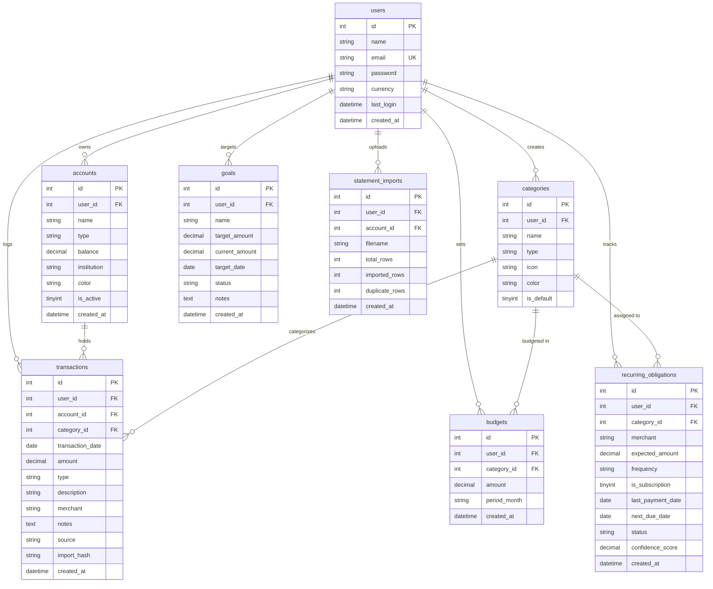

# FinPilot — Personal Finance Decision Support Agent

[](https://www.php.net/)
[](https://www.mysql.com/)
[](https://tailwindcss.com/)
[](https://www.chartjs.org/)
[](https://icons.getbootstrap.com/)
[](#4-system-architecture)
[](#license)

> A modern, self-hosted, user-scoped personal finance management and deterministic decision-support application built in pure PHP 8+ MVC with zero heavy framework overhead.

---

## Table of Contents

- [1. Project Overview](#1-project-overview)
- [2. Key Capabilities & Features](#2-key-capabilities--features)
- [3. Grounded AI Decision-Support Agent](#3-grounded-ai-decision-support-agent)
- [4. System Architecture](#4-system-architecture)
- [5. Domain Data Model & Schema](#5-domain-data-model--schema)
- [6. Directory & File Structure](#6-directory--file-structure)
- [7. System Requirements](#7-system-requirements)
- [8. Installation & Quickstart](#8-installation--quickstart)
- [9. Configuration](#9-configuration)
- [10. Available Scripts & Seeding](#10-available-scripts--seeding)
- [11. Routing & Endpoints](#11-routing--endpoints)
- [12. Security Architecture](#12-security-architecture)
- [13. Testing & Verification](#13-testing--verification)
- [14. Troubleshooting & FAQ](#14-troubleshooting--faq)

---

## 1. Project Overview

**FinPilot** is a purpose-built personal finance web application designed to help individuals track their net worth, manage multi-account ledgers, monitor budgets, achieve savings goals, and make informed financial decisions through an integrated **Grounded AI Decision-Support Agent**.

### The Problem It Solves
Most commercial budgeting platforms require third-party bank credential sharing, enforce monthly subscription fees, or lock user data behind proprietary ecosystems. Generic spreadsheets often lack automated recurring expense detection, interactive visual analytics, and natural language decision assistance.

FinPilot delivers:
- **Zero Third-Party Dependency Overhead:** No heavy PHP frameworks (Laravel/Symfony) or runtime bloat. Runs on standard PHP 8+ and MySQL/MariaDB.
- **Strict User Data Isolation:** Multi-user ready where every entity (accounts, transactions, categories, budgets, goals) is strictly foreign-keyed to `user_id`.
- **Grounded Decision Assistance:** An on-device, deterministic AI agent that answers spending and budgeting questions directly from your verified ledger data without hallucinations or speculative advice.
- **Modern Glassmorphic Dark UI:** Crafted with Tailwind CSS, Chart.js, and Bootstrap Icons for an intuitive desktop and mobile user experience.

---

## 2. Key Capabilities & Features

### 🏦 Multi-Account Ledger Management
- Support for multiple account types: **Checking**, **Savings**, **Credit Card**, **Cash Wallet**, and **Investment**.
- Real-time balance tracking with automatic balance adjustments upon transaction creation, modification, or deletion.
- One-click balance recalculation utility from historical ledger entries.
- Overall Net Worth calculation and visual breakdown.

### 💸 Income & Expense Transaction Tracking
- Full CRUD transactions with signed amounts, date picker, category tag, account selector, merchant name, and optional notes.
- Instant search, date/month filtering, transaction type filtering (Income / Expense), and account filtering.
- Pagination support for fast loading of extensive ledgers.

### 🎯 Monthly Category Budgeting
- Set monthly spending caps per category (e.g. Dining Out, Groceries, Utilities).
- Dynamic visual utilization progress bars with adaptive threshold coloring:
  - 🟢 **Normal** (< 80% used)
  - 🟡 **Caution** (80% – 99% used)
  - 🔴 **Over Budget** (≥ 100% used)
- Real-time budget alert notifications in the top navigation bar.

### 🏆 Savings Goals Tracker
- Create dedicated financial targets (e.g., Emergency Fund, Vacation, Down Payment).
- Set target amount, target completion date, and track deposit progress.
- Visual completion percentage bars and remaining amount calculations.
- Dedicated modal to quickly deposit funds toward any active goal.

### 🔄 Recurring Bills & Subscription Monitor
- Track fixed and variable recurring obligations (e.g., Netflix, Spotify, Rent, Utilities, Gym).
- Automated frequency handling (Weekly, Monthly, Yearly) with normalized monthly cost projections.
- Due-date urgency flags (Due Today, Due in X Days, Overdue).
- Dedicated Subscription flag for tracking digital SaaS and media memberships.

### 📥 Bank Statement CSV Importer
- Upload bank/credit card CSV statements with file size and MIME validation.
- Interactive column mapper supporting Date, Amount, Description, and Type columns.
- **Duplicate Detection:** SHA-256 hash generation (`date:amount:description:account_id`) to prevent duplicate transaction entries.
- **Heuristic Auto-Categorization:** Automatically suggests categories based on merchant keywords (e.g., "Uber" → Transportation, "Netflix" → Entertainment/Subscriptions).
- Batch preview table with status indicators before committing imports to the ledger.

### 📊 Reports & Financial Analytics
- Monthly cash flow summaries (Income vs. Expense vs. Net Savings).
- 6-Month cash flow trend bar chart powered by Chart.js.
- Category spending distribution doughnut chart.
- Month-over-Month spending comparison table with absolute deltas and percentage changes.
- Automated anomaly detection flagging categories exceeding 1.5× the 3-month average.
- One-click CSV export of transaction data.

---

## 3. Grounded AI Decision-Support Agent

FinPilot features a deterministic, grounded decision-support engine designed around financial safety guardrails.

```
                    ┌─────────────────────────┐
                    │      User Question      │
                    └────────────┬────────────┘
                                 │
                                 ▼
                    ┌─────────────────────────┐
                    │  Regex / Keyword Match  │
                    │   & Intent Classifier   │
                    └────────────┬────────────┘
                                 │
                 ┌───────────────┴───────────────┐
                 ▼                               ▼
       [Financial Domain Query]       [Advisory / Speculative Query]
                 │                               │
                 ▼                               ▼
    ┌──────────────────────────┐    ┌──────────────────────────┐
    │ Grounded Tool Execution  │    │  Safety Guardrail Reject │
    │ (User-Scoped DB Queries) │    │  (Non-advisory response) │
    └────────────┬─────────────┘    └────────────┬─────────────┘
                 │                               │
                 ▼                               ▼
    ┌──────────────────────────┐    ┌──────────────────────────┐
    │ Structured Markdown Ans  │    │  Disclaimer & Suggestion │
    │ + Follow-Up Question Chips│    └──────────────────────────┘
    └──────────────────────────┘
```

### Agent Tool Registry
1. **`get_monthly_summary(month)`**: Computes income, expenses, net savings, and savings rate.
2. **`get_category_spending(month)`**: Ranks top expense categories with percentage of total spending.
3. **`get_budget_status(month)`**: Evaluates all budgets, highlighting near-limit and exceeded categories.
4. **`get_recurring_obligations()`**: Summarizes upcoming bills within the next 30 days and total monthly projected commitments.
5. **`get_goal_progress()`**: Audits active savings targets, current balances, and remaining amounts.
6. **`detect_unusual_spending(month)`**: Identifies categories with abnormal surges compared to 3-month rolling averages.

### Safety & Guardrail Boundaries
- The agent explicitly avoids speculative investment advice (e.g., stock picking, crypto predictions, loan endorsements).
- Always provides a non-advisory safety disclaimer reminding users to consult accredited financial professionals for major decisions.

---

## 4. System Architecture

FinPilot follows a clean Model-View-Controller (MVC) pattern coupled with an autonomous Service Layer.

```
finpilot/
├── app/
│   ├── Core/          # Foundation: Router, Database Singleton, Session, Model, Controller, Helpers
│   ├── Models/        # Active Record Entities (User, Account, Transaction, Budget, Goal, etc.)
│   ├── Services/      # Business Logic (TransactionService, BudgetService, AnalysisService, etc.)
│   └── Controllers/   # HTTP Request Handlers (Auth, Dashboard, Transaction, Agent, etc.)
├── config/            # Environment & application configurations
├── database/          # SQL schema definitions & seed scripts
├── public/            # Web server root (index.php, CSS, JS)
├── scripts/           # CLI tools (database seeder)
├── storage/           # Temporary statement uploads and file cache
└── views/             # Server-rendered PHP templates (layouts, auth, features)
```

### Architectural Highlights
- **Single Entry Front Controller (`public/index.php`):** Dispatches requests via a regex-capable HTTP router supporting GET, POST, and simulated PUT/DELETE.
- **Database Access Object (`App\Core\Database`):** Thread-safe PDO Singleton with prepared statements, error logging, and explicit transaction methods (`beginTransaction`, `commit`, `rollBack`).
- **Session & CSRF Handler (`App\Core\Session`):** Encapsulates flash messaging and timing-safe CSRF token generation/validation with `hash_equals()`.
- **Base Model (`App\Core\Model`):** Provides user-scoping query helpers (`whereUser`, `sumUser`, `findForUser`) to prevent Insecure Direct Object References (IDOR).

---

## 5. Domain Data Model & Schema

All financial data strictly enforces user ownership via foreign keys referencing `users(id) ON DELETE CASCADE`.



---

## 6. Directory & File Structure

```
.
├── .env                              # Environment configuration (DB credentials, app settings)
├── .env.example                      # Template configuration file
├── .gitignore                        # Git exclusion rules
├── .htaccess                         # Apache root redirect to public/
├── README.md                         # Project documentation
├── app/
│   ├── Controllers/
│   │   ├── AccountController.php     # Account management (checking, savings, cards)
│   │   ├── AgentController.php       # AI Decision Agent chat & API endpoint
│   │   ├── AuthController.php        # Login, user registration, and logout
│   │   ├── BudgetController.php      # Monthly spending limits & tracking
│   │   ├── DashboardController.php   # Main financial overview & statistics
│   │   ├── GoalController.php        # Savings goals & deposit progress
│   │   ├── ImportController.php      # CSV statement upload & column mapper
│   │   ├── RecurringController.php   # Bills & subscription tracking
│   │   ├── ReportController.php      # Analytics, MoM trends & CSV export
│   │   ├── SettingController.php     # Profile, currency settings & data reset
│   │   └── TransactionController.php # Transaction ledger CRUD & filtering
│   ├── Core/
│   │   ├── Controller.php            # Base controller (auth checks, input validation)
│   │   ├── Database.php              # PDO Database singleton & connection tester
│   │   ├── Helpers.php               # Escaping, URLs, currencies, and date helpers
│   │   ├── Model.php                 # Base model with user-scoped active-record methods
│   │   ├── Router.php                # Fast regex HTTP routing engine
│   │   └── Session.php               # Session management & CSRF protection
│   ├── Models/
│   │   ├── Account.php               # Account balances & net worth queries
│   │   ├── Budget.php                # Monthly budget caps & spending joins
│   │   ├── Category.php              # Income/expense default & custom categories
│   │   ├── Goal.php                  # Savings targets & milestone calculations
│   │   ├── RecurringObligation.php   # Bills, frequencies & monthly projections
│   │   ├── StatementImport.php       # Statement upload batch logs
│   │   ├── Transaction.php           # Ledger entries, monthly totals & summaries
│   │   └── User.php                  # User authentication & password hashing
│   └── Services/
│       ├── AgentService.php          # AI query intent classification & tool execution
│       ├── AnalysisService.php       # MoM deltas, savings rates & anomaly detection
│       ├── BudgetService.php         # Budget utilization & over-budget alerts
│       ├── ImportService.php         # CSV parsing, de-duplication & categorization
│       └── TransactionService.php    # Transaction balance mutations & adjustments
├── config/
│   ├── config.php                    # Application settings (currency, session, limits)
│   ├── database.php                  # PDO connection options with safe fallback defaults
│   └── env.php                       # Custom .env parser with placeholder detection
├── database/
│   ├── database.sql                  # Combined schema and seed file
│   ├── schema.sql                    # Clean table definitions & indexes
│   └── seed.sql                      # Rich synthetic demo dataset
├── public/
│   ├── .htaccess                     # URL rewrite rules routing all requests to index.php
│   ├── index.php                     # Front Controller bootstrapping
│   └── assets/
│       ├── css/
│       │   └── login-modern.css      # Modern glassmorphic styles for auth screens
│       └── js/
│           └── app.js                # Toast notifications, modals & formatters
├── scripts/
│   └── seed.php                      # CLI database seeder (supports --fresh flag)
├── storage/
│   └── imports/                      # Temporary statement storage directory
└── views/
    ├── accounts/index.php            # Accounts management view
    ├── agent/index.php               # AI Decision Agent interactive chat interface
    ├── auth/
    │   ├── login.php                 # User login view
    │   └── register.php              # User self-registration view
    ├── budgets/index.php             # Budgets view with utilization gauges
    ├── dashboard/index.php           # Financial cockpit with KPIs, charts, and alerts
    ├── goals/index.php               # Savings goals view with deposit modals
    ├── import/index.php              # CSV upload, column mapping & preview view
    ├── layouts/
    │   ├── app.php                   # Master glassmorphic layout wrapper
    │   ├── footer.php                # Global footer
    │   ├── header.php                # Navigation header with financial alert dropdown
    │   └── sidebar.php               # Collapsible navigation sidebar
    ├── recurring/index.php           # Recurring obligations & subscriptions view
    ├── reports/index.php             # Spending trends, charts & CSV export
    ├── settings/index.php            # User preferences, currency, and data reset
    └── transactions/
        ├── create.php                # Transaction create & edit form
        └── index.php                 # Filterable & searchable transactions ledger
```

---

## 7. System Requirements

- **PHP:** Version 8.0 or higher.
- **PHP Extensions:**
  - `pdo` and `pdo_mysql` (Database communication)
  - `mbstring` (Multibyte string manipulation)
  - `fileinfo` (File upload MIME inspection)
- **Database:** MySQL 5.7+ or MariaDB 10.3+.
- **Web Server:** Apache (with `mod_rewrite` enabled), Nginx, or PHP built-in CLI web server.

---

## 8. Installation & Quickstart

Follow these steps to set up FinPilot on your local environment:

### Step 1: Clone or Open the Repository
```bash
cd "d:/billing project/billing project"
```

### Step 2: Configure Environment
Copy `.env.example` to `.env` (or configure your existing `.env`):
```ini
DB_HOST=127.0.0.1
DB_PORT=3306
DB_NAME=finpilot_db
DB_USER=root
DB_PASS=

APP_NAME="FinPilot"
APP_URL=http://localhost:8000
APP_DEBUG=true
```

### Step 3: Run the Automated Database Seeder
The included CLI seeder automatically creates the `finpilot_db` database if it doesn't already exist, applies `schema.sql`, and populates realistic synthetic demo data:
```bash
php scripts/seed.php --fresh
```

Expected output:
```
🚀 FinPilot Seeder
────────────────────────────────────────
⚡ Running schema.sql (--fresh)...
✅ Schema created.
🌱 Running seed.sql...
✅ Seed complete!

┌──────────────────────────────────────┐
│  Demo Credentials                    │
│  Email:    demo@finpilot.app         │
│  Password: finpilot123               │
└──────────────────────────────────────┘
```

### Step 4: Start the Local Development Server
Run PHP's built-in web server pointing to the `public/` directory:
```bash
php -S localhost:8000 -t public
```

### Step 5: Access the Application
Open your browser and navigate to:
```
http://localhost:8000
```
Log in using the pre-seeded demo account:
- **Email:** `demo@finpilot.app`
- **Password:** `finpilot123`

*(Alternatively, click **"Create Account"** to register your own personal profile with your preferred local currency).*

---

## 9. Configuration

Application configurations are centralized in `config/`:

| File | Purpose | Key Configurations |
|---|---|---|
| `config/config.php` | Application settings | `app_name`, `app_url`, `session.lifetime`, `uploads.max_size`, `currency`, supported currencies list |
| `config/database.php` | Database connection settings | Host, port, credentials with smart placeholder validation and fallback handling |
| `config/env.php` | Environment loader | Parses `.env`, filters comments and placeholder values |

---

## 10. Available Scripts & Seeding

### CLI Database Seeder (`scripts/seed.php`)
```bash
# Seed demo data into existing tables
php scripts/seed.php

# Recreate all tables from scratch and re-seed (Fresh reset)
php scripts/seed.php --fresh
```

### Manual SQL Import
If preferred, you can import directly into MySQL via the command line:
```bash
mysql -u root -p -e "CREATE DATABASE IF NOT EXISTS finpilot_db;"
mysql -u root -p finpilot_db < database/database.sql
```

---

## 11. Routing & Endpoints

| Method | Path | Controller Action | Description |
|---|---|---|---|
| `GET` | `/health/db` | `Database::testConnection` | Database health & connectivity check (JSON) |
| `GET` | `/login` | `AuthController@loginForm` | Render login view |
| `POST` | `/login` | `AuthController@login` | Authenticate user credentials |
| `GET` | `/register` | `AuthController@registerForm` | Render registration view |
| `POST` | `/register` | `AuthController@register` | Register new user account |
| `GET` | `/logout` | `AuthController@logout` | Terminate session & redirect to login |
| `GET` | `/` or `/dashboard` | `DashboardController@index` | Main financial cockpit |
| `GET` | `/transactions` | `TransactionController@index` | Paginated transaction ledger |
| `GET` | `/transactions/create` | `TransactionController@create` | Form to log new transaction |
| `POST` | `/transactions/store` | `TransactionController@store` | Create transaction & adjust balance |
| `GET` | `/transactions/{id}/edit` | `TransactionController@edit` | Edit transaction form |
| `POST` | `/transactions/{id}/update`| `TransactionController@update` | Update transaction & rebalance account |
| `POST` | `/transactions/{id}/delete`| `TransactionController@delete` | Delete transaction & reverse balance effect |
| `GET` | `/accounts` | `AccountController@index` | Account list & creation view |
| `POST` | `/accounts/store` | `AccountController@store` | Create new financial account |
| `POST` | `/accounts/{id}/update` | `AccountController@update` | Edit account details |
| `POST` | `/accounts/{id}/delete` | `AccountController@delete` | Remove account |
| `GET` | `/budgets` | `BudgetController@index` | Monthly budget progress view |
| `POST` | `/budgets/store` | `BudgetController@store` | Set category monthly budget cap |
| `POST` | `/budgets/{id}/delete` | `BudgetController@delete` | Remove budget cap |
| `GET` | `/goals` | `GoalController@index` | Savings targets & progress view |
| `POST` | `/goals/store` | `GoalController@store` | Create new savings target |
| `POST` | `/goals/{id}/deposit` | `GoalController@deposit` | Add deposit toward savings goal |
| `POST` | `/goals/{id}/delete` | `GoalController@delete` | Delete savings goal |
| `GET` | `/recurring` | `RecurringController@index` | Bills & subscriptions view |
| `POST` | `/recurring/store` | `RecurringController@store` | Add recurring obligation |
| `POST` | `/recurring/{id}/delete` | `RecurringController@delete` | Remove recurring obligation |
| `GET` | `/import` | `ImportController@index` | CSV statement import view |
| `POST` | `/import/upload` | `ImportController@upload` | Parse CSV & preview mapped rows |
| `POST` | `/import/confirm` | `ImportController@confirm` | Save batch into ledger |
| `GET` | `/agent` | `AgentController@index` | AI Decision Agent chat interface |
| `POST` | `/agent/query` | `AgentController@query` | AJAX natural language inquiry endpoint |
| `GET` | `/reports` | `ReportController@index` | Spending analytics & trends |
| `GET` | `/reports/export` | `ReportController@export` | Export user transactions as CSV |
| `GET` | `/settings` | `SettingController@index` | User preferences & profile view |
| `POST` | `/settings/update` | `SettingController@update` | Update profile / currency / password |
| `POST` | `/settings/reset` | `SettingController@resetData` | Wipe user transactions (Danger zone) |

---

## 12. Security Architecture

FinPilot applies defense-in-depth principles:

1. **Authentication & Password Storage:** Passwords hashed with `PASSWORD_BCRYPT` with cost factor 12.
2. **CSRF Protection:** Every state-modifying POST request requires a valid `_csrf_token`, verified with timing-attack resistant `hash_equals()`.
3. **SQL Injection Prevention:** 100% of SQL operations utilize parameterized prepared statements via PDO with `PDO::ATTR_EMULATE_PREPARES => false`.
4. **Cross-Site Scripting (XSS) Prevention:** Output escaping via `e()` (`htmlspecialchars(..., ENT_QUOTES, 'UTF-8')`) across all view templates.
5. **Insecure Direct Object Reference (IDOR) Mitigation:** All entity queries (`findForUser`, `whereUser`, `deleteForUser`) explicitly filter by `user_id = ?`, preventing access across accounts.
6. **Error Suppression in Production:** Verbose PHP errors are suppressed from rendering to clients in `public/index.php` and routed to internal PHP logs.

---

## 13. Testing & Verification

### Syntax & Lint Checks
Validate that all PHP source files are free of syntax errors:
```powershell
Get-ChildItem -Recurse -Filter *.php | ForEach-Object { php -l $_.FullName }
```

### Database Connectivity Verification
Check database connection and configuration state:
```bash
php -r "require 'config/env.php'; require 'app/Core/Database.php'; echo json_encode(App\Core\Database::testConnection());"
```

### Synthetic Seeder Verification
Ensure tables and demo records are successfully provisioned:
```bash
php scripts/seed.php --fresh
```

---

## 14. Troubleshooting & FAQ

### Q: "SQLSTATE[HY000] [1049] Unknown database 'finpilot_db'"
**A:** Run `php scripts/seed.php --fresh`. The seeder will automatically connect to MySQL and execute `CREATE DATABASE IF NOT EXISTS finpilot_db` before creating tables.

### Q: "Invalid CSRF token on POST requests"
**A:** Ensure your session is active. If you were idle for over 2 hours, your session expired. Refresh the page to obtain a fresh CSRF token.

### Q: "How do I change the display currency?"
**A:** Navigate to **Settings** in the application menu and choose your preferred currency symbol (`$`, `₹`, `€`, `£`, `¥`). All amounts across dashboard, reports, and transactions will adapt immediately.

### Q: "Can I self-host this with Apache or Nginx?"
**A:** Yes. An `.htaccess` file is pre-configured with URL rewriting for Apache. For Nginx, point `root` to `/path/to/public` and include `try_files $uri $uri/ /index.php?$query_string;`.

---

## License

This project is licensed under the [MIT License](LICENSE).
FinPilot &copy; 2026. Built with precision for personal finance decision support.
